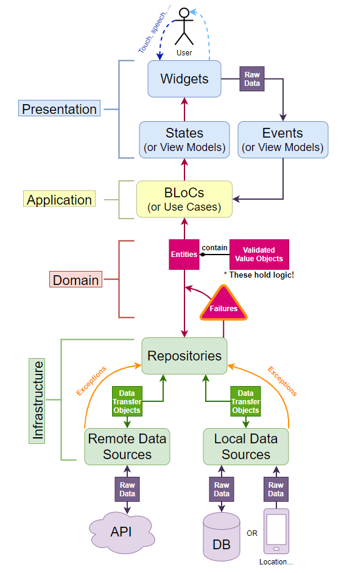

<div id="top"></div>

<!-- PROJECT LOGO -->
<br />
<div align="center">

  <h1 align="center">MockSeries</h1>

  <p align="center">
   A series demo app
   
</div>

<!-- TABLE OF CONTENTS -->
<details>
  <summary>Table of Contents</summary>
  <ol>
    <li>
      <a href="#about-the-project">About The Project</a>
      <ul>
        <li><a href="#built-with">Built With</a></li>
      </ul>
    </li>
    <li>
      <a href="#getting-started">Getting Started</a>
      <ul>
        <li><a href="#prerequisites">Prerequisites</a></li>
        <li><a href="#installation">Installation</a></li>
      </ul>
    </li>
    <li><a href="#apk">Apk</a></li>
    <li><a href="#roadmap">Roadmap</a></li>    
  </ol>
</details>

<!-- ABOUT THE PROJECT -->

## About The Project

This is a mobile application for listing TV series, using the API provided by the TVMaze
website.
You can find the API <a href="https://www.tvmaze.com/api">here.</a>

### Architecture

This diagram shows how the data flows through the app and how it manages inputs from external entities.



### Built With

- [Flutter](https://flutter.dev/)

<!-- GETTING STARTED -->

## Getting Started

### Prerequisites

- [Follow](https://flutter.dev/docs/get-started/install)

### Installation

1. Clone the repo
   ```sh
   git clone https://github.com/pabrcno/mock_series.git
   ```
2. Add dependencies
   ```sh
   flutter pub get
   ```

<!-- USAGE EXAMPLES -->

## Apk

Install the android Android Apk from the <a href="https://github.com/pabrcno/mock_series/tree/main/releases">releases folder</a>

<!-- ROADMAP -->

## RoadMap

- [x] List all of the series contained in the API used by the paging scheme provided by the
      API.
- [x] Allow users to search series by name.
- [x] The listing and search views must show at least the name and poster image of the
      series.
- [x] After clicking on a series, the application should show the details of the series.
- [x] After clicking on an episode, the application should show the episode’s information.

### Bonus

- [x] Allow the user to save a series as a favorite.
- [x] Allow the user to delete a series from the favorites list.
- [x] Allow the user to browse their favorite series in alphabetical order, and click on one to
      see its details.

<!-- CONTACT -->

## Get to know me better 🚀

<a href="https://pabrcno.github.io/portfolio/">Portfolio</a>

Paulo Briceño - [@paulobricenog](https://twitter.com/paulobricenog) - pabrcn@gmail.com

<p align="right">(<a href="#top">back to top</a>)</p>
